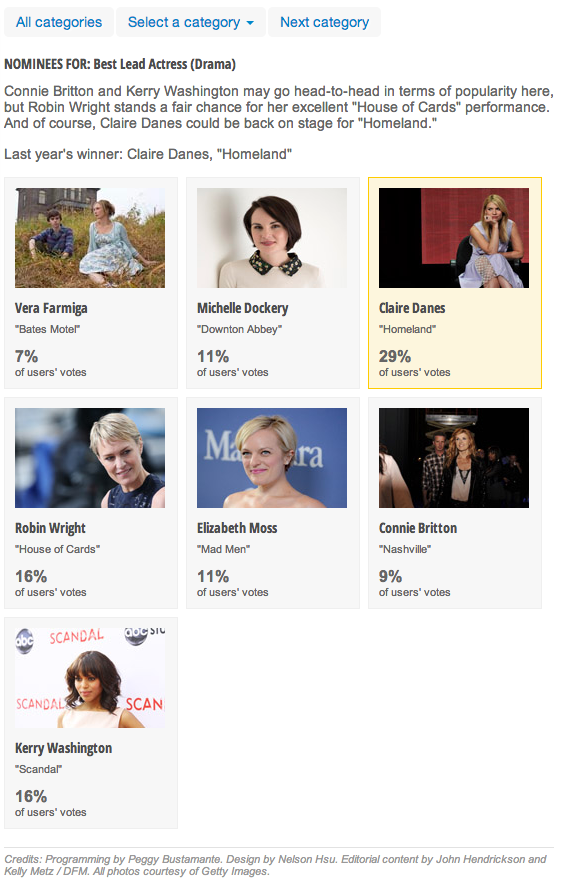

Emmy Ballot 
========================

What is this?
-------------

A PHP and JS tool to display nominees in an event and collect user votes on predicted winners. This iteration was used for the 2013 Emmys.
Live demo: http://www.contracostatimes.com/ci_24105588

Credits
---------
Peggy Bustamante

Assumptions
-----------

* JQuery
* PHP
* MySQL
* Google Doc

What's in here?
---------------

The project contains the following folders and important files:

* ``index.php`` -- main file.
* ``JS`` -- JavaScript files. vote.js has all the action and business logic.
* ``data`` -- Data files, in a CSV, JSON and SQL formats.
* ``incl`` -- PHP file to record user's selections/votes
* ``css`` -- Base css files to get rolling with.

How to use this
----------------

1. Make a copy of these Google docs:
	categories: https://docs.google.com/spreadsheet/ccc?key=0Apk83VzG7OVldHZGckZSY0JYU0w3TWN6QTFmOUlMcUE&usp=drive_web#gid=0
	nominees: https://docs.google.com/spreadsheet/ccc?key=0Apk83VzG7OVldEJJdWRTejlKdkt3WWNkTjMzS2h0UWc&usp=drive_web#gid=0
	
2. upload your data to MySQL tables.
3. Change the SQL calls to your named tables in index.php, nominees.php, print.php, results.php.

Recommendation: remove static data (nominees names, category names etc.) from the database and pull them in from CSV or JSON files. Only use the database for vote count.

## Gotchas

There are things that are hard-coded into js/vote.js. One of those things is the number of categories, which changes from year to year.

Also hard-coded: This app works differently before the winners are announced than it does after, and we need to write instructions on how to handle both (right now it's set for before the winners are announced).

# License

The MIT License (MIT)

Copyright (c) 2015 The Denver Post

Permission is hereby granted, free of charge, to any person obtaining a copy
of this software and associated documentation files (the "Software"), to deal
in the Software without restriction, including without limitation the rights
to use, copy, modify, merge, publish, distribute, sublicense, and/or sell
copies of the Software, and to permit persons to whom the Software is
furnished to do so, subject to the following conditions:

The above copyright notice and this permission notice shall be included in all
copies or substantial portions of the Software.

THE SOFTWARE IS PROVIDED "AS IS", WITHOUT WARRANTY OF ANY KIND, EXPRESS OR
IMPLIED, INCLUDING BUT NOT LIMITED TO THE WARRANTIES OF MERCHANTABILITY,
FITNESS FOR A PARTICULAR PURPOSE AND NONINFRINGEMENT. IN NO EVENT SHALL THE
AUTHORS OR COPYRIGHT HOLDERS BE LIABLE FOR ANY CLAIM, DAMAGES OR OTHER
LIABILITY, WHETHER IN AN ACTION OF CONTRACT, TORT OR OTHERWISE, ARISING FROM,
OUT OF OR IN CONNECTION WITH THE SOFTWARE OR THE USE OR OTHER DEALINGS IN THE
SOFTWARE.
